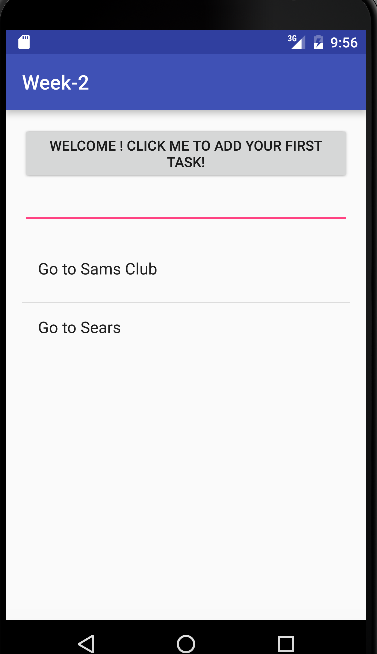

#Project 1 - To Do List
by Jesseniah Mendoza

##Objective - 
<em>Cut off the Color,Laughter and Excitement and lets get straight to work.With this Simple To Do List you will find yourselff accomplishing tasks in no time.

##Product:
<em>A simple To Do List App that allows a user to Add,Open and Save to different List.

## Prototyping:

<em>Step 1 - Is the homescreen.Here the user can see the App in Default and can add a task.

<em>Step 2 - Still on the Default page. Observe as the user types in there first task.In this case ,"Go to Sams Club." and they are able to click and submit there task.

<em>Onto the second page once the user has submitted there task.For Example:"Go to Sams Club" They can specify what It is they wish to buy at Sams Club.A list with in a list.The user begins to title there item list.
Example: Buy Eggs.The user is not only able to write down there list but aswell save and go back to the Homescreen.

<em>Finally,now back at the Homescreen,the user can go back and make another list such as going to Sears.

##Hope you enjoyed this Simple To Do List App!

