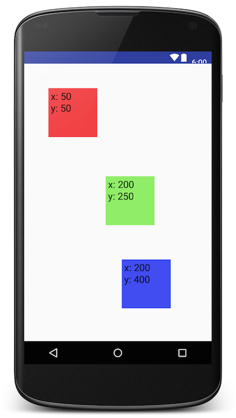
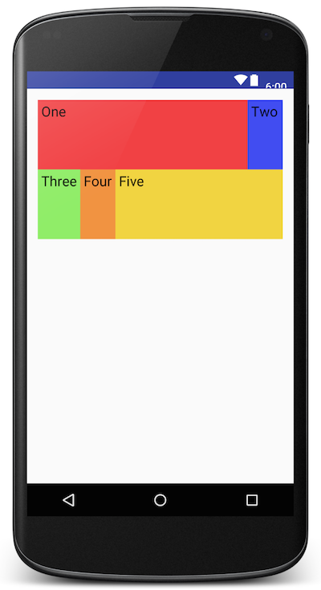
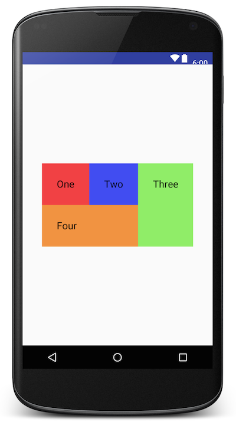
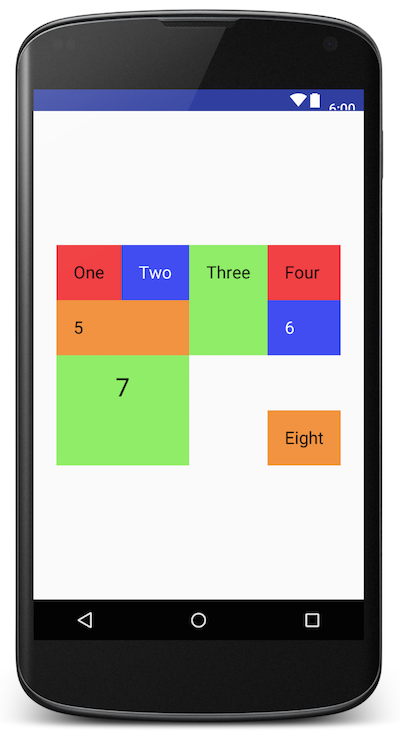
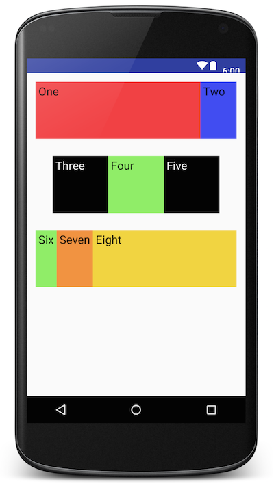

# Layouts

### LEARNING OBJECTIVES
*After this lesson, you will be able to:*

- Identify all of the common Layout Views used in Android
- Know how to create any combination of Layout Views to achieve a complex design


## AbsoluteLayout

A layout that lets you specify exact locations (x/y coordinates) of its children. Absolute layouts are less flexible and harder to maintain than other types of layouts without absolute positioning.

```xml
<AbsoluteLayout 
    xmlns:android="http://schemas.android.com/apk/res/android"
    xmlns:tools="http://schemas.android.com/tools"
    android:layout_width="match_parent"
    android:layout_height="match_parent"
    tools:context="com.gcraven.layoutexample.AbsoluteLayoutActivity">
    <TextView
        android:layout_width="100dp"
        android:layout_height="100dp"
        android:layout_x="50dp"
        android:layout_y="50dp"
        android:background="@color/red"
        android:text="x: 50\ny: 50" />
    <TextView
        android:layout_width="100dp"
        android:layout_height="100dp"
        android:layout_x="167dp"
        android:layout_y="230dp"
        android:background="@color/green"
        android:text="x: 200\ny: 250" />
    <TextView
        android:layout_width="100dp"
        android:layout_height="100dp"
        android:layout_x="200dp"
        android:layout_y="400dp"
        android:background="@color/blue"
        android:text="x: 200\ny: 400" />
</AbsoluteLayout>
```
 



---

##TableLayout

TableLayout is a ViewGroup that displays child View elements in rows and columns.

TableLayout positions its children into rows and columns. TableLayout containers do not display border lines for their rows, columns, or cells. The table will have as many columns as the row with the most cells. A table can leave cells empty, but cells cannot span columns, as they can in HTML.

```xml
<TableLayout xmlns:android="http://schemas.android.com/apk/res/android"
    xmlns:tools="http://schemas.android.com/tools"
    android:layout_width="match_parent"
    android:layout_height="match_parent"
    android:padding="16dp"
    tools:context="com.gcraven.layoutexample.TableLayoutActivity">

    <TableRow>
        <TextView
            android:layout_width="0dp"
            android:layout_height="100dp"
            android:layout_weight="1"
            android:background="@color/red"
            android:text="One" />
        <TextView
            android:layout_width="wrap_content"
            android:layout_height="100dp"
            android:background="@color/blue"
            android:text="Two" />
    </TableRow>

    <TableRow>

        <TextView
            android:layout_width="wrap_content"
            android:layout_height="100dp"
            android:text="Three"
            android:background="@color/green"/>
        <TextView
            android:layout_width="wrap_content"
            android:layout_height="100dp"
            android:text="Four"
            android:background="@color/orange"/>
        <TextView
            android:layout_width="0dp"
            android:layout_height="100dp"
            android:layout_weight="1"
            android:text="Five"
            android:background="@color/yellow"/>
    </TableRow>

</TableLayout>
```


---


##GridLayout

A layout that places its children in a rectangular grid.

The grid is composed of a set of infinitely thin lines that separate the viewing area into cells. Throughout the API, grid lines are referenced by grid indices. A grid with N columns has N + 1 grid indices that run from 0 through N inclusive. Regardless of how GridLayout is configured, grid index 0 is fixed to the leading edge of the container and grid index N is fixed to its trailing edge (after padding is taken into account).

```xml
<GridLayout 
	 xmlns:android="http://schemas.android.com/apk/res/android"
    xmlns:tools="http://schemas.android.com/tools"
    android:id="@+id/GridLayout1"
    android:layout_width="wrap_content"
    android:layout_height="wrap_content"
    android:layout_gravity="center"
    android:columnCount="3"
    tools:context=".GridLayoutActivity" >

    <TextView
        android:layout_column="0"
        android:layout_gravity="left|top"
        android:layout_row="0"
        android:text="One"
        android:padding="30dp"
        android:background="@color/red"/>
    <TextView
        android:layout_column="1"
        android:layout_gravity="left|top"
        android:layout_row="0"
        android:text="Two"
        android:padding="30dp"
        android:background="@color/blue"/>
    <TextView
        android:layout_column="2"
        android:layout_gravity="fill_vertical"
        android:layout_row="0"
        android:layout_rowSpan="2"
        android:text="Three"
        android:padding="30dp"
        android:background="@color/green"/>
    <TextView
        android:layout_column="0"
        android:layout_columnSpan="2"
        android:layout_gravity="fill_horizontal"
        android:layout_row="1"
        android:text="Four"
        android:padding="30dp"
        android:background="@color/orange"/>

</GridLayout>
```



---


#Challenge


